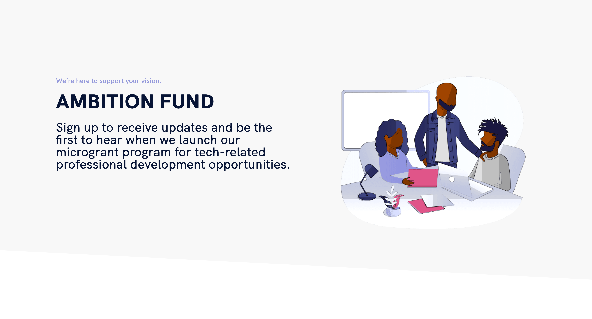

<!-- ALL-CONTRIBUTORS-BADGE:START - Do not remove or modify this section -->
[](#contributors-)
<!-- ALL-CONTRIBUTORS-BADGE:END -->

## Ambition Fund [](https://app.netlify.com/sites/ambitionfund/deploys)


- [https://www.ambitionfund.org ](https://www.ambitionfund.org)
- The Ambition Fund's mission is to support the professional ambitions of underrepresented people pursuing careers in technology by increasing access to free and low-cost professional development opportunities.
- Contributors welcome!



## 🤝 Contributing

Contributions, issues and feature requests are welcome!<br />Check out the [issues page](https://github.com/M0nica/ambition-fund-website/issues) to see what functionality needs help.

### How can I get involved now?

For now, if you see a [GitHub Issues](https://github.com/M0nica/ambition-fund-website/issues) you're interested in working on, comment on the task expressing your interest.

### Branch Name Conventions

When contributing, please fork this repository by clicking the “fork” button at the top right. This creates your own copy of the repository where you’re able to make changes. Once you have forked the repository, please structure your branches using the following format.

`feature/task-description` - Feature branches are for all new feature work. The task description should be descriptive enough to quickly understand the work done in this branch. Please keep your features concise and ensure the work done in this branch directly relates to your task.

`fix/task-description` - Fix branches should be leveraged for bug fixes on existing features

`hotfix/task-description` - Hotfix branches should only ever be leveraged for _critical_ bug fixes that need attention immediately. This would only be use if there is a broken feature or bug on production that needs to be addressed urgently.

### Pull Requests

To send your changes for review, open a pull request. If you’ve never opened a pull request before, [read Thanoshan’s article on creating a pull request](https://www.freecodecamp.org/news/how-to-make-your-first-pull-request-on-github-3/) for more information!

### Getting started

Fork and download the repository

Navigate to project on your computer and install dependencies:

```sh
yarn install
```

start the development server:

```sh
gatsby develop
```

run unit tests:

```sh
yarn test
```

To have tests re-run as files change then run `yarn test:watch`.

At the project root, compile your application for deployment:

```sh
gatsby build
```

Clean the cache to fix certain errors - run the clean command before starting the dev server:

```sh
gatsby clean
```

At the project root, serve the production build of your site:

```sh
gatsby serve
```

### Styles

This website uses [styled-components](https://www.styled-components.com/). The theme file contains the base styles `src/styles/theme.js` and the global styles file contains basic element styles and a style reset `src/styles/GlobalStyles.js`.

### Unit Testing

Unit tests are written with the [React-Testing-Library](https://github.com/testing-library/react-testing-library)

Checkout out [testing-playground.com](https://testing-playground.com) for a quick way to run queries against your own html.

### Navigation

This website uses [react-anchor-link-smooth-scroll](https://github.com/mauricevancooten/react-anchor-link-smooth-scroll#readme) and [react-scrollspy](https://github.com/makotot/react-scrollspy).
To link a navigation item to a section simply add an id and string value to a section parent element that corresponds to the same navigation string value in `navigation.js`

## Contributors ✨

Thanks goes to these wonderful people ([emoji key](https://allcontributors.org/docs/en/emoji-key)):

<!-- ALL-CONTRIBUTORS-LIST:START - Do not remove or modify this section -->
<!-- prettier-ignore-start -->
<!-- markdownlint-disable -->
<table>
  <tr>
    <td align="center"><a href="https://www.aboutmonica.com"><br /><sub><b>Monica Powell</b></sub></a><br /><a href="https://github.com/M0nica/ambition-fund-website/commits?author=m0nica" title="Code">💻</a></td>
    <td align="center"><a href="https://github.com/jordan-paz"><br /><sub><b>Jordan Paz</b></sub></a><br /><a href="https://github.com/M0nica/ambition-fund-website/commits?author=jordan-paz" title="Code">💻</a></td>
    <td align="center"><a href="https://omaratta.me/resume"><br /><sub><b>Omar Atta</b></sub></a><br /><a href="https://github.com/M0nica/ambition-fund-website/commits?author=omaratta212" title="Code">💻</a></td>
  </tr>
</table>

<!-- markdownlint-enable -->
<!-- prettier-ignore-end -->
<!-- ALL-CONTRIBUTORS-LIST:END -->

This project follows the [all-contributors](https://github.com/all-contributors/all-contributors) specification. Contributions of any kind welcome!
